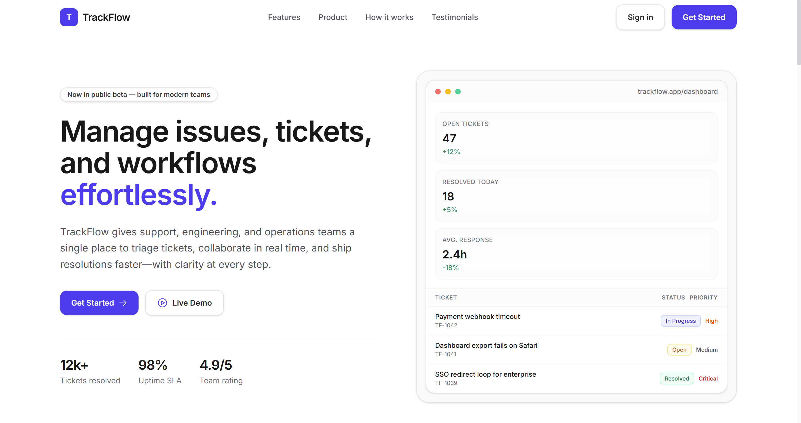
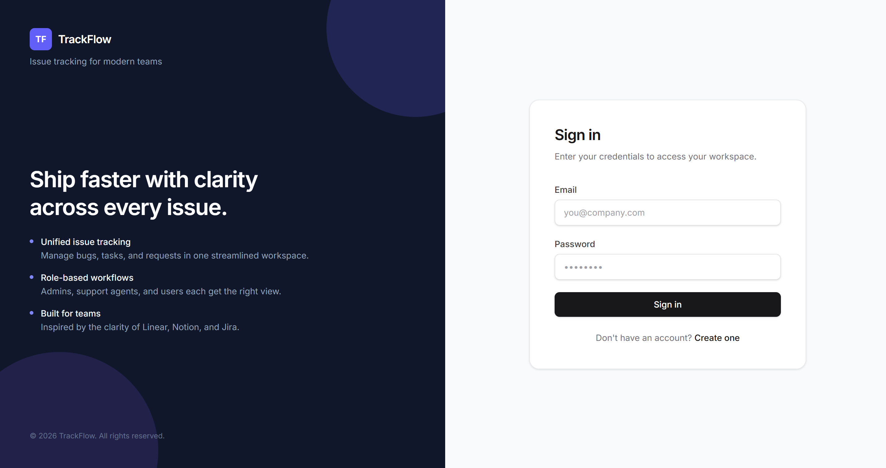
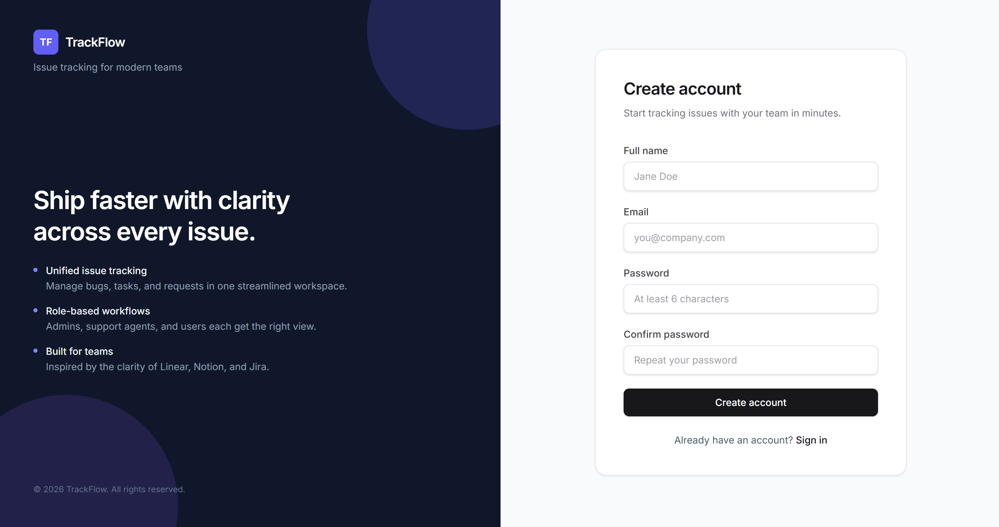
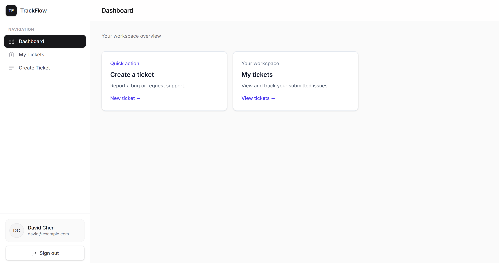
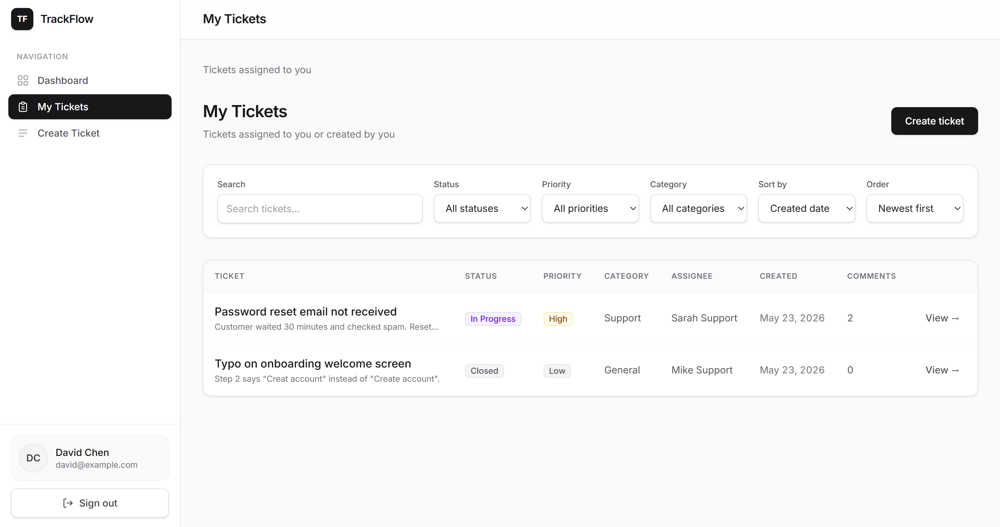
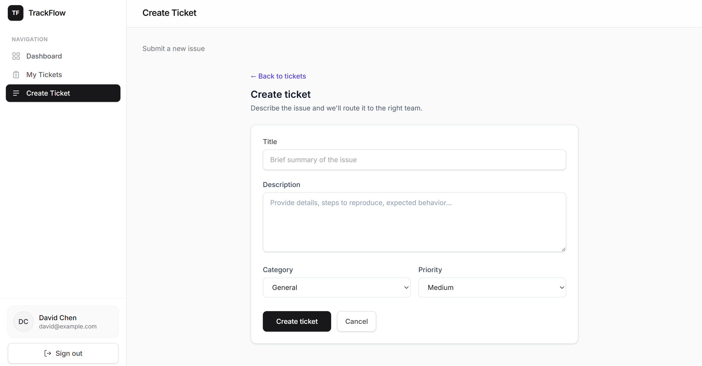
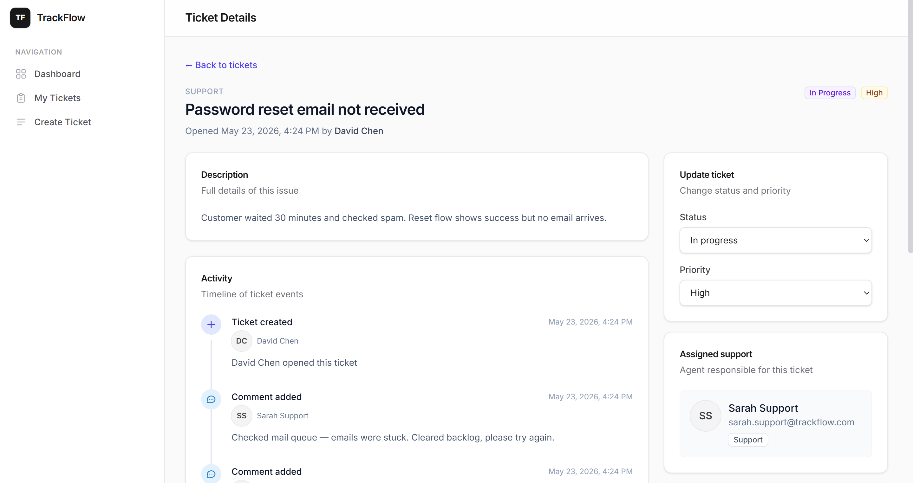
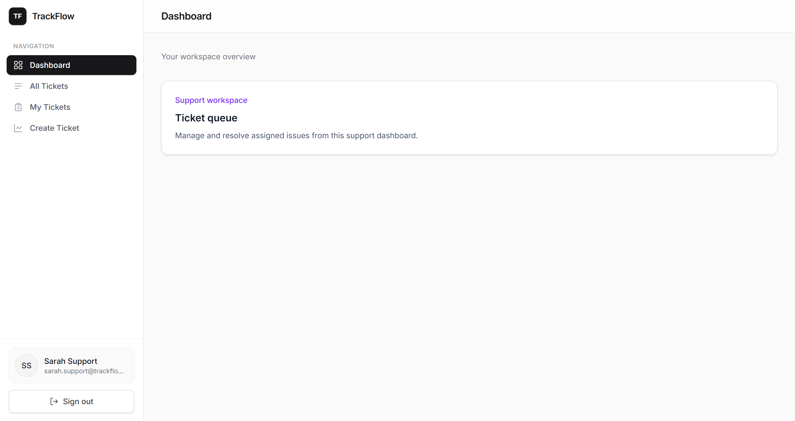
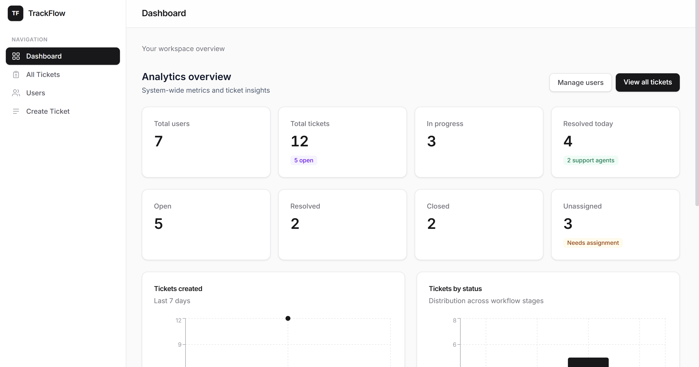

# TrackFlow

A full-stack **MERN issue tracking system** for teams to create, assign, and resolve support tickets with role-based access control, real-time-style workflows, and an admin analytics dashboard.


---

## Features

### Authentication & authorization
- JWT-based authentication (register, login, session restore)
- Role-based access control: **Admin**, **Support**, **User**
- Protected routes on frontend and backend
- Role-based redirects after login

### Ticket management
- Create, read, update, and delete tickets
- Ticket fields: title, description, category, priority, status
- Assign tickets to support agents (admin)
- Filter by status, priority, category, assignee, creator
- Full-text search on title and description
- Sorting and pagination
- Status workflow: `open` → `in_progress` → `resolved` → `closed`
- Priority levels: `low`, `medium`, `high`, `urgent`

### Comments
- Relational comment model linked to tickets and users
- Add and list comments with populated author info
- Comment count on ticket responses
- Activity timeline on ticket detail page

### Dashboards (role-specific)
- **User** — personal tickets, create issues, ticket detail with comments
- **Support** — full ticket queue, assigned tickets, status/priority updates
- **Admin** — analytics dashboard (Recharts), user management, assign agents, delete tickets

### Admin panel
- View and search all users
- Change user roles
- Analytics cards and charts (tickets by status, priority, trend, users by role)
- List support agents for assignment
- Delete any ticket

### UI/UX
- Modern SaaS design (Linear / Notion / Vercel inspired)
- Responsive sidebar layout with mobile collapse
- Reusable modals and confirmation dialogs
- Loading states and skeleton loaders
- Toast notifications
- Status and priority badges

---

## Tech stack

| Layer | Technologies |
|-------|----------------|
| **Frontend** | React 19, Vite, Tailwind CSS v4, React Router, Axios, Recharts, React Hot Toast |
| **Backend** | Node.js, Express 5, Mongoose |
| **Database** | MongoDB |
| **Auth** | JSON Web Tokens (JWT), bcryptjs |
| **Validation** | express-validator |

---

## Project structure

```
TrackFlow/
├── backend/
│   ├── src/
│   │   ├── config/          # DB connection, env config
│   │   ├── constants/       # Roles, ticket enums
│   │   ├── controllers/     # Route handlers
│   │   ├── middleware/      # Auth, roles, validation, errors
│   │   ├── models/          # User, Ticket, Comment
│   │   ├── routes/          # API route modules
│   │   ├── scripts/         # seed.js
│   │   ├── utils/           # Helpers, pagination, access control
│   │   ├── app.js
│   │   └── server.js
│   ├── .env.example
│   └── package.json
├── frontend/
│   ├── src/
│   │   ├── components/    # UI, dashboard, tickets, admin
│   │   ├── context/         # AuthContext
│   │   ├── hooks/
│   │   ├── layouts/         # Auth, Dashboard, Main
│   │   ├── pages/           # Auth, tickets, admin, dashboards
│   │   ├── routes/
│   │   ├── services/        # API clients
│   │   └── utils/
│   ├── .env.example
│   └── package.json
└── README.md
```

---

## Prerequisites

- **Node.js** 18 or higher
- **npm** 9+ (or yarn/pnpm)
- **MongoDB** 6+ (local install or [MongoDB Atlas](https://www.mongodb.com/atlas))

---

## Installation

### 1. Clone the repository

```bash
git clone <your-repo-url>
cd TrackFlow
```

### 2. Backend setup

```bash
cd backend
npm install
cp .env.example .env
```

Edit `backend/.env` with your values (see [Environment variables](#environment-variables)).

```bash
npm run seed    # optional but recommended for demo data
npm run dev
```

API runs at **http://localhost:5000**

### 3. Frontend setup

Open a new terminal:

```bash
cd frontend
npm install
cp .env.example .env
npm run dev
```

App runs at **http://localhost:5173**

> During development, Vite proxies `/api` requests to the backend when `VITE_API_URL` is set to `/api` or you use the default proxy in `vite.config.js`.

---

## Environment variables

### Backend (`backend/.env`)

| Variable | Required | Default | Description |
|----------|----------|---------|-------------|
| `NODE_ENV` | No | `development` | Environment mode |
| `PORT` | No | `5000` | Server port |
| `MONGODB_URI` | **Yes** | — | MongoDB connection string |
| `JWT_SECRET` | **Yes** | — | Secret for signing JWT tokens |
| `JWT_EXPIRES_IN` | No | `7d` | Token expiry (e.g. `7d`, `24h`) |
| `CLIENT_URL` | No | `http://localhost:5173` | Allowed CORS origin (frontend URL) |

**Example:**

```env
NODE_ENV=development
PORT=5000
MONGODB_URI=mongodb://127.0.0.1:27017/trackflow
JWT_SECRET=your_super_secret_key_change_in_production
JWT_EXPIRES_IN=7d
CLIENT_URL=http://localhost:5173
```

### Frontend (`frontend/.env`)

| Variable | Required | Default | Description |
|----------|----------|---------|-------------|
| `VITE_API_URL` | No | `/api` | API base URL (use full URL in production) |

**Development:**

```env
VITE_API_URL=/api
```

**Production (example):**

```env
VITE_API_URL=https://api.yourdomain.com/api
```

---

## Seed instructions

Populate the database with sample users, tickets, and comments:

```bash
cd backend
npm run seed
```

> **Warning:** This **deletes all existing** users, tickets, and comments before inserting seed data. Use only on local or disposable databases.

### Default credentials

**Password for all accounts:** `password123`

| Role | Email |
|------|-------|
| Admin | `admin@trackflow.com` |
| Support | `sarah.support@trackflow.com`, `mike.support@trackflow.com` |
| User | `emma@example.com`, `james@example.com`, `priya@example.com`, `david@example.com` |

### Seed data summary

- **7 users** (1 admin, 2 support, 4 users)
- **12 tickets** — mixed statuses, priorities, and categories; some assigned, some unassigned
- **14 comments** — linked to tickets via MongoDB references

---

## User roles

| Role | Permissions |
|------|-------------|
| **User** | Register/login; create tickets; view and update **own** tickets; add comments on own tickets; delete own tickets |
| **Support** | View **all** tickets; update **assigned** tickets (status, priority); add comments on assigned tickets; filter `?mine=true` for assigned queue |
| **Admin** | Full access; manage all tickets; delete any ticket; assign support agents; view analytics; manage users and roles |

### Frontend routes by role

| Role | Base path |
|------|-----------|
| User | `/dashboard` |
| Support | `/support/dashboard` |
| Admin | `/admin/dashboard` |

Each role has nested routes for tickets (`/tickets`, `/tickets/new`, `/tickets/:id`). Admin also has `/users` for user management.

---

## API routes

Base URL: `http://localhost:5000/api`

Protected routes require header:

```
Authorization: Bearer <your_jwt_token>
```

### Health & test

| Method | Endpoint | Auth | Description |
|--------|----------|------|-------------|
| `GET` | `/test` | No | API smoke test |
| `GET` | `/health` | No | Health check with timestamp |

### Authentication

| Method | Endpoint | Auth | Description |
|--------|----------|------|-------------|
| `POST` | `/auth/register` | No | Register new user |
| `POST` | `/auth/login` | No | Login, returns JWT + user |
| `GET` | `/auth/me` | Yes | Get current user profile |

### Tickets

| Method | Endpoint | Auth | Description |
|--------|----------|------|-------------|
| `POST` | `/tickets` | Yes | Create ticket |
| `GET` | `/tickets` | Yes | List tickets (filters, search, pagination) |
| `GET` | `/tickets/:id` | Yes | Get single ticket |
| `PUT` | `/tickets/:id` | Yes | Update ticket |
| `DELETE` | `/tickets/:id` | Yes | Delete ticket |

**Query parameters (GET `/tickets`):**

| Param | Type | Description |
|-------|------|-------------|
| `status` | string | `open`, `in_progress`, `resolved`, `closed` |
| `priority` | string | `low`, `medium`, `high`, `urgent` |
| `category` | string | `bug`, `feature`, `support`, `general` |
| `assignedTo` | ObjectId | Filter by assignee |
| `createdBy` | ObjectId | Filter by creator |
| `unassigned` | boolean | `true` for unassigned tickets |
| `mine` | boolean | `true` for support assigned tickets |
| `search` | string | Search title and description |
| `page` | number | Page number (default `1`) |
| `limit` | number | Items per page (default `10`, max `100`) |
| `sortBy` | string | `createdAt`, `updatedAt`, `priority`, `status`, `title` |
| `order` | string | `asc` or `desc` |

### Comments

| Method | Endpoint | Auth | Description |
|--------|----------|------|-------------|
| `GET` | `/tickets/:ticketId/comments` | Yes | List comments for a ticket |
| `POST` | `/tickets/:ticketId/comments` | Yes | Add comment |

**Query parameters (GET comments):** `page`, `limit`, `order` (`asc` \| `desc`)

### Admin (admin role only)

| Method | Endpoint | Description |
|--------|----------|-------------|
| `GET` | `/admin/analytics` | Dashboard stats and chart data |
| `GET` | `/admin/users` | List users (`search`, `role`, pagination) |
| `PUT` | `/admin/users/:id/role` | Update user role (`body: { role }`) |
| `GET` | `/admin/agents` | List support/admin users for assignment |

### Example requests

**Login:**

```bash
curl -X POST http://localhost:5000/api/auth/login \
  -H "Content-Type: application/json" \
  -d '{"email":"admin@trackflow.com","password":"password123"}'
```

**Create ticket:**

```bash
curl -X POST http://localhost:5000/api/tickets \
  -H "Authorization: Bearer YOUR_TOKEN" \
  -H "Content-Type: application/json" \
  -d '{
    "title": "Sample issue",
    "description": "Detailed description here",
    "category": "bug",
    "priority": "high"
  }'
```

---

## Screenshots

> Add screenshots to `/docs/screenshots/` and update the paths below.

### Landing / home



### Authentication




### User dashboard





### Ticket detail



### Support dashboard



### Admin panel




---

## NPM scripts

### Backend

| Command | Description |
|---------|-------------|
| `npm run dev` | Start dev server with Nodemon |
| `npm start` | Start production server |
| `npm run seed` | Seed database with sample data |

### Frontend

| Command | Description |
|---------|-------------|
| `npm run dev` | Start Vite dev server |
| `npm run build` | Production build to `dist/` |
| `npm run preview` | Preview production build locally |

---

## Deployment guide

### Overview

Deploy **MongoDB**, **backend API**, and **frontend** separately. Typical setup:

1. MongoDB Atlas (database)
2. Railway / Render / Fly.io (backend)
3. Vercel / Netlify / Cloudflare Pages (frontend)

### 1. MongoDB Atlas

1. Create a free cluster at [mongodb.com/atlas](https://www.mongodb.com/atlas)
2. Create a database user and whitelist IP (`0.0.0.0/0` for cloud hosts)
3. Copy the connection string → use as `MONGODB_URI`

### 2. Deploy backend

**Example: Render**

1. New **Web Service** → connect repo, root directory `backend`
2. Build command: `npm install`
3. Start command: `npm start`
4. Set environment variables:

```env
NODE_ENV=production
PORT=5000
MONGODB_URI=mongodb+srv://...
JWT_SECRET=<long-random-secret>
JWT_EXPIRES_IN=7d
CLIENT_URL=https://your-frontend.vercel.app
```

5. Note your API URL, e.g. `https://trackflow-api.onrender.com`

**Run seed once (optional):**

```bash
# From local machine with production MONGODB_URI in .env
npm run seed
```

### 3. Deploy frontend

**Example: Vercel**

1. Import repo, root directory `frontend`
2. Framework preset: **Vite**
3. Build command: `npm run build`
4. Output directory: `dist`
5. Environment variable:

```env
VITE_API_URL=https://trackflow-api.onrender.com/api
```

6. Redeploy after env changes (Vite bakes env at build time)

### 4. Post-deployment checklist

- [ ] `JWT_SECRET` is strong and unique in production
- [ ] `CLIENT_URL` matches your exact frontend origin (no trailing slash)
- [ ] MongoDB Atlas network access allows your API host
- [ ] CORS works (test login from deployed frontend)
- [ ] HTTPS enabled on both frontend and API
- [ ] Seed data **not** run on production unless intentional

### Local production preview

```bash
# Backend
cd backend && npm start

# Frontend
cd frontend && npm run build && npm run preview
```

---

## Development notes

- Ticket **comments** use a separate `Comment` collection with references to `Ticket` and `User` (not embedded arrays).
- Deleting a ticket cascades deletion of its comments.
- JWT is stored in `localStorage` on the client (`trackflow_token`, `trackflow_user`).
- Express validates requests with `express-validator`; errors return `{ success: false, message }`.

---

## License

This project is for educational and portfolio use. Add your preferred license (e.g. MIT) as needed.

---

## Author

Built as a full-stack MERN capstone project — **TrackFlow** issue tracking for modern teams.
